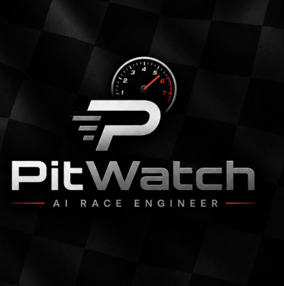

<p align="center">
  
</p>

<p align="center"><b>An AI race engineer for Assetto Corsa Competizione and Le Mans Ultimate.</b></p>

---

PitWatch reads live telemetry from your sim and talks to you like a real race engineer -
fuel and pit strategy, sector-by-sector analysis, damage calls, race commentary, and a live
track map with every car on it.

## Install

1. Download `PitWatch-win-Setup.exe` from the latest release.
2. Run it. Installation takes a few seconds.
3. Follow the setup screen. **Everything on it is optional** - you can skip it entirely.

No .NET download needed. **PitWatch updates itself** - you'll never have to come back here
to download a newer version. When one is available you'll get a banner in the app, click
once, and you're on the new version with all your settings intact.

### Windows will show a blue warning the first time

That's SmartScreen. It appears for any application that hasn't been downloaded thousands of
times yet, and it isn't a virus warning. Click **More info → Run anyway**.

If you'd rather verify before trusting it, the full source is in this repository - you can
read it and build it yourself with `dotnet build`.

## What works without any API key

- Live dashboard: speed, gear, RPM, fuel, tyre temps and pressures, lap times, damage, G-force
- Spoken race commentary: overtakes, crashes, damage, low fuel, race start and finish
- Sector analysis: which sector you lost time in, theoretical best, personal best alerts
- Fuel and pit strategy, including multi-stop and fuel saving targets
- Stint summaries and a full post-race debrief
- Live track map with all cars
- Session history with comparison between runs

## Optional API keys

Both are free to obtain and entirely optional. Keys are encrypted on your PC and sent only
to the provider they belong to. PitWatch has no server and collects nothing.

| Key | What it unlocks | Get one |
|---|---|---|
| Google Gemini | Asking questions in your own words, and voice input | [aistudio.google.com/apikey](https://aistudio.google.com/apikey) |
| ElevenLabs | A natural human voice instead of the Windows one | [elevenlabs.io](https://elevenlabs.io/app/settings/api-keys) |

## Track map and car proximity

Settings → Track Map → one button. PitWatch configures ACC's side for you. Restart ACC
afterwards so it picks up the change.

## Le Mans Ultimate

LMU needs the community rF2 shared memory plugin, the same one Crew Chief and SimHub use.
Search for `rF2SharedMemoryMapPlugin` on GitHub, drop the DLL into `<LMU install>\Plugins\`,
and enable it in-game. It is not bundled here - please get it from its own project.

## Honest limitations

Some things simply are not present in the data these games expose to external apps. No
amount of code can produce them, and PitWatch will tell you so rather than guess:

- **Tyre wear** - confirmed by inspecting raw memory that ACC always reports zero. Temps and
  pressures work fine.
- **Yellow / blue / other flags** - local sector flags aren't in the telemetry.
- **Penalties** - not clearly exposed.
- **Weather forecasts** - not available.
- **Corner names** - coaching says "you're slow around 40% through the lap" rather than
  naming the corner, because no corner map is provided to the app.

## Building from source

Requires the .NET 8 SDK or newer, on Windows.

```
dotnet build PitWatch.sln -c Release
dotnet run --project PitWatch.Gui -c Release
```

To produce an installable, self-updating release, run `build-release.bat 1.0.0`. See
[RELEASING.md](RELEASING.md) for the full process.

## Something went wrong?

PitWatch writes a log to `%APPDATA%\PitWatch\pitwatch.log`. About → Open log file will
open it. Attaching that to a bug report makes it far easier to diagnose.

## Not affiliated

PitWatch is an independent community project. It is not affiliated with, endorsed by, or
supported by Kunos Simulazioni, Studio 397, Google, or ElevenLabs. Assetto Corsa Competizione
and Le Mans Ultimate are trademarks of their respective owners.

## License

MIT - see [LICENSE](LICENSE).
